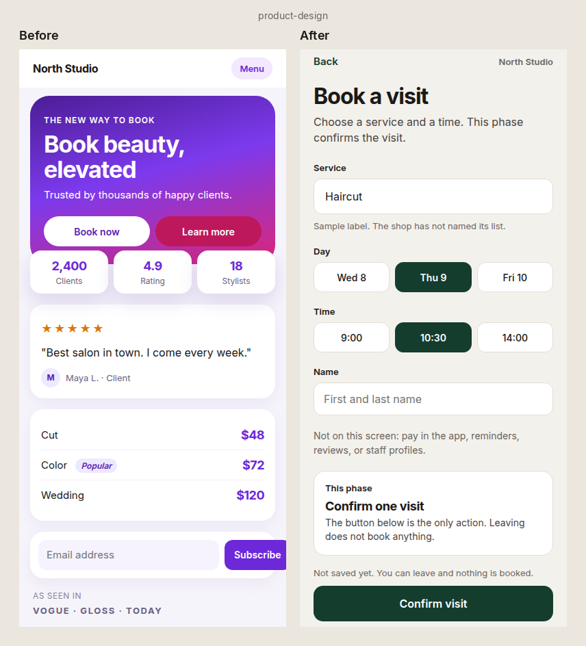
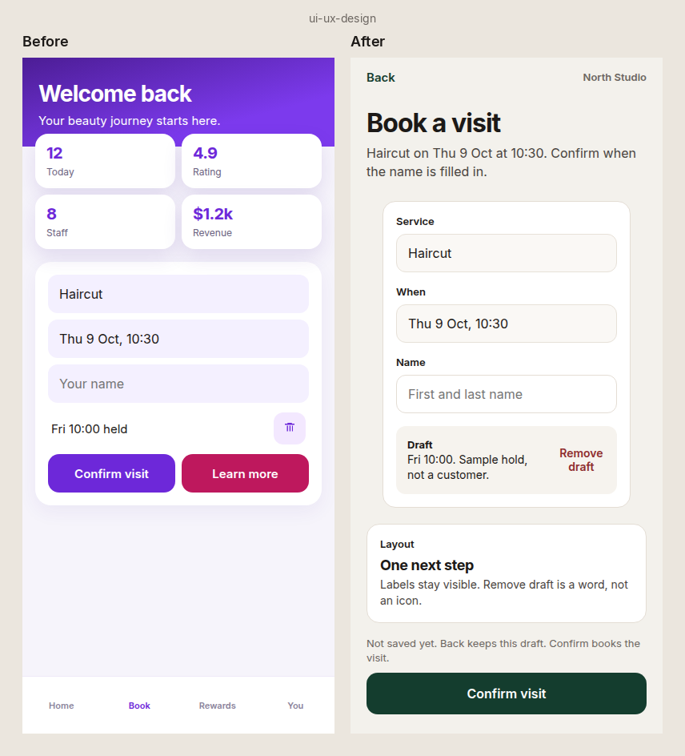
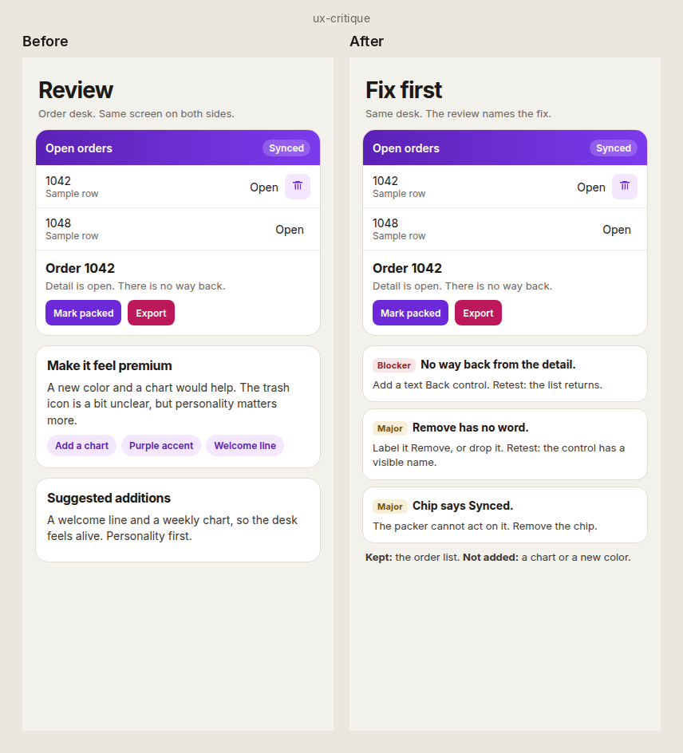
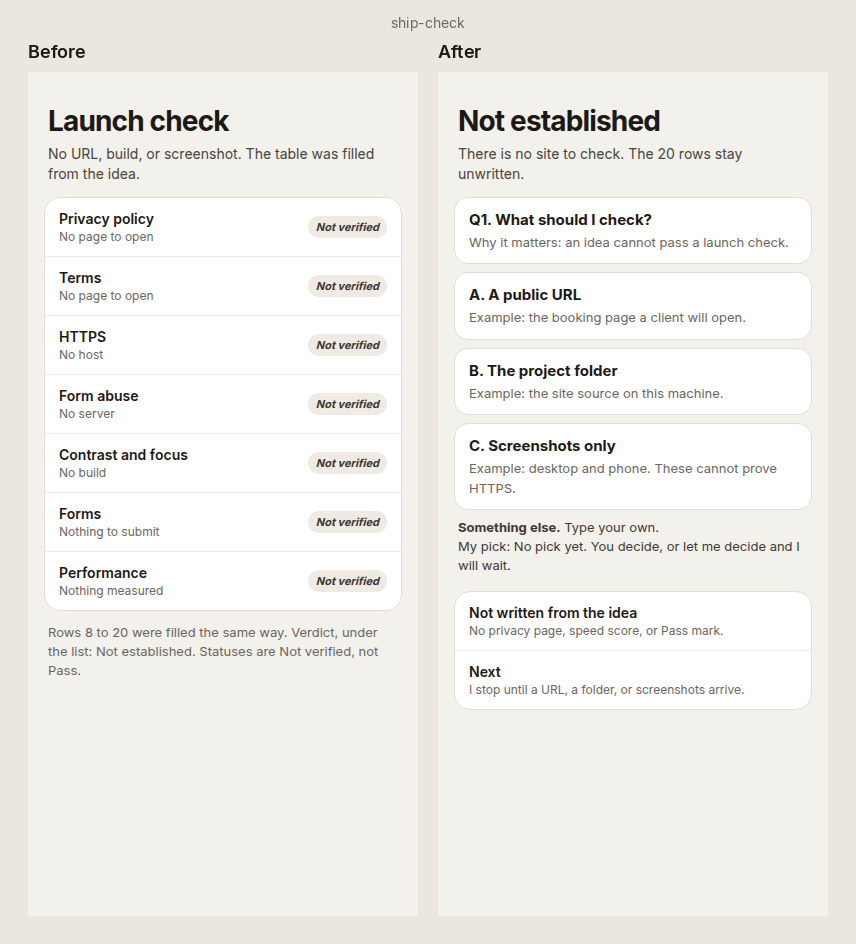
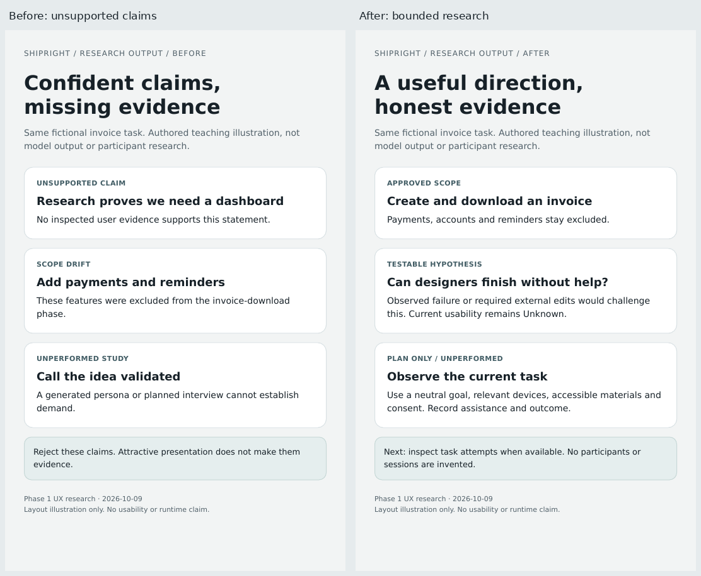

# ShipRight

**Version 0.6.2**
**Context before generate. Product before pixels.**

ShipRight helps AI design and coding tools follow your product decisions before generating UI.
It connects the user job, current phase, flows, screen layout and verification evidence.
It does not guarantee perfect designs or replace user testing.

## Start

1. Unzip this pack and keep the entire `shipright-skills/` folder together.
2. Make that folder readable by your tool. Start with the matching skill path below.
3. Supply your task, current phase and existing screen/docs when available. The skill asks only material missing questions.

| Task | Entry file |
| --- | --- |
| Frame an idea or define a flow | [product-design](skills/product-design/SKILL.md) |
| Design a screen or apply exact visual feedback | [ui-ux-design](skills/ui-ux-design/SKILL.md) |
| Review an existing artifact | [ux-critique](skills/ux-critique/SKILL.md) |
| Check a launch or specific release item | [ship-check](skills/ship-check/SKILL.md) |

Example for a local coding tool:

> Read shipright-skills/skills/ui-ux-design/SKILL.md and its required references. Our current phase is registration. Apply this feedback exactly: [changes]. Preserve the existing design system. Keep later ideas out of the UI.

Use the actual unpacked path if different. Keep `_shared`, references, docs and personal-taste available at their original relative locations.
A single pasted SKILL.md is incomplete; its fallback rules do not reproduce the full pack.
Do not copy this pack's AGENTS.md into your app. It is for maintaining ShipRight itself.

## Tool setup

Claude Code, Cursor, Codex, and ChatGPT can read the local Markdown pack when it is available in their workspace or attached files.
For automatic skill discovery, use the current client's supported registration method and point it to the canonical skill files.
Avoid separate edited copies for each client. Symlink handling and sandbox access vary; confirm references resolve in your client.
For a design tool without local file access, provide the whole pack through its supported file/project context mechanism.
Claude Design ingestion and all native client installs have not been verified for this release. Manual file-based use is the portable route.

## What changes in 0.6

- Exact feedback becomes keep/remove/change/add instructions with acceptance checks.
- Current-phase scope controls every visible element. Later ideas stay in notes, not UI.
- Intake asks 0-5 questions total before starting; clear tasks need none.
- Existing identity and components are preserved. Brand values, data and features are never invented.
- Flow feedback uses the operator's language and hides routine system plumbing.
- Layout, selection, pending work and accessibility have concrete checks.
- Shorter skill entries load detailed references only when relevant.
- 0.6.1-draft restores concrete icon, placement and question-card rules, and moves the IVC corrections into the example.

## Requested outputs

### Phase 1 research update (working branch, not a new release)

Product-design can select research methods, prepare lightweight guides and distinguish
reported claims, observed behavior, interpretations, hypotheses and unknowns.
It inspects supplied evidence first; clear corrections do not trigger discovery.
Unavailable tools or participants remain explicit. Simulated users never count as research.
Users see concise decisions, material assumptions and limits; detailed plans are supplied only when useful/requested.
This update does not add full research synthesis or establish demand through a competitor scan.

A small fix gets a small response. A full project can use PRODUCT.md, DESIGN.md and the templates under docs/.
Other project documents normally live under docs/shipright/. Reuse existing equivalents.
A request to write authorizes the requested files. Read before updating and preserve unrelated content.
The pitch and full launch report are optional. Readiness never authorizes deployment, publication or payment.

## Evidence

Reviews distinguish specifications, visible designs and exercised implementation.
Checks use Pass, Fail, Not verified or Not applicable with a reason. A ticket does not resolve a failure.

Run source validation from the unpacked folder:

```bash
python3 evals/check_sources.py
python3 evals/check_sources.py --self-test
```

See [0.6 evaluation evidence](evals/v0.6/results.md). Source checks and controlled trials do not establish cross-model or client performance.
See [Phase 1 research evaluation](evals/phase-1-ux-research/results.md) for new cases and limits.
The [IVC example](examples/ivc-2026-registration/README.md) is historical and includes documented defects and evidence limits.
Do not use its prototype or training candidates as current approved implementation guidance.

## Optional preferences and map

[Altaz's profile](personal-taste/altaz.md) is active only when selected. It cannot change scope or override approved identity.
[skills.md](skills.md) routes tasks. [architecture.md](architecture.md) explains file ownership and loading.
[CHANGELOG.md](CHANGELOG.md) records the release. Names and original paths are retained.

## How it improved

Each pair is the same idea, shown on a phone-width screen. Before is the polished generic screen 0.6.1-draft allowed. After is what this version asks for. Numbers, quotes, and prices on the before screens were not supplied.

**Product design.** A salon booking idea. The old path drew a marketing site. The new path keeps one booking task.

[Before](examples/before-after/0.6.2/product-design/before.png) and [after](examples/before-after/0.6.2/product-design/after.png).



**UI/UX design.** The same booking task. The old layout has a gradient, summary cards, unlabeled fields, and two filled buttons. The new layout has labels, one action, and a way back.

[Before](examples/before-after/0.6.2/ui-ux-design/before.png) and [after](examples/before-after/0.6.2/ui-ux-design/after.png).



**UX critique.** The same order desk. The old write-up restyles it. The new write-up names the fix.

[Before](examples/before-after/0.6.2/ux-critique/before.png) and [after](examples/before-after/0.6.2/ux-critique/after.png).



**Ship check.** No site was supplied. The old path filled a launch list. The new path asks one question and stops.

[Before](examples/before-after/0.6.2/ship-check/before.png) and [after](examples/before-after/0.6.2/ship-check/after.png).



Future updates keep a new folder under `examples/before-after/` and follow [tests/README.md](tests/README.md).

**Phase 1 research output.** A task-aligned research plan versus an ungrounded research claim.
Both are authored teaching illustrations, not participant evidence or controlled model output.



MIT license for the pack. Example brand assets retain their existing ownership notices.
